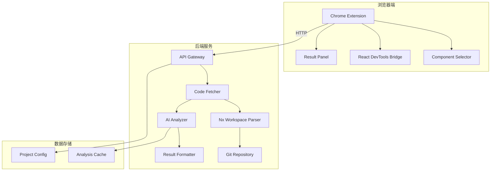

# Design Document: Component Code Analyzer

## Overview

组件代码分析器是一个帮助非技术人员理解 Castlery Joyboy 前端代码的工具。系统采用浏览器插件 + 后端服务的架构，通过 React DevTools 协议识别页面组件，后端从 Git 仓库获取源码并调用 AI 进行分析，最终以自然语言形式展示组件的业务逻辑。

### 系统架构图



## Architecture

### 整体架构

系统分为三个主要部分：

1. **浏览器插件（Browser Extension）**
   - 负责组件选择和结果展示
   - 通过 React DevTools 协议获取组件信息
   - 与后端服务通过 HTTP 通信

2. **后端分析服务（Backend Service）**
   - 负责代码获取和 AI 分析
   - 理解 Nx Monorepo 结构
   - 管理项目配置和分析缓存

3. **代码仓库（Code Repository）**
   - Joyboy Git 仓库
   - 支持多分支（测试/UAT）

### 技术选型

| 组件 | 技术选择 | 理由 |
|------|----------|------|
| 浏览器插件 | Chrome Extension Manifest V3 | 现代标准，安全性好 |
| 插件UI | React + TailwindCSS | 与目标项目技术栈一致 |
| 后端服务 | Node.js + Express | 便于解析 TypeScript/JavaScript |
| AI分析 | OpenAI GPT-4 API | 代码理解能力强 |
| 代码解析 | TypeScript Compiler API | 精确解析 TS 代码 |
| Git操作 | simple-git | 轻量级 Git 操作库 |

## Components and Interfaces

### 1. 浏览器插件组件

#### 1.1 Component Selector

```typescript
interface ComponentInfo {
  displayName: string;           // 组件显示名称
  fileName: string;              // 源文件名
  filePath: string | null;       // 源文件路径（如果可获取）
  componentType: 'fortress' | 'business' | 'shared' | 'unknown';
  props: Record<string, unknown>;
  fiberNode: FiberNodeInfo;
}

interface FiberNodeInfo {
  tag: number;
  type: string;
  key: string | null;
  stateNode: unknown;
  _debugSource?: {
    fileName: string;
    lineNumber: number;
    columnNumber: number;
  };
}

interface ComponentSelector {
  // 激活选择模式
  activate(): void;
  
  // 停用选择模式
  deactivate(): void;
  
  // 获取鼠标悬停位置的组件信息
  getComponentAtPoint(x: number, y: number): ComponentInfo | null;
  
  // 高亮显示组件边界
  highlightComponent(element: HTMLElement): void;
  
  // 清除高亮
  clearHighlight(): void;
}
```

#### 1.2 React DevTools Bridge

```typescript
interface ReactDevToolsBridge {
  // 检查页面是否使用 React
  isReactPage(): boolean;
  
  // 获取 React 版本
  getReactVersion(): string | null;
  
  // 从 DOM 元素获取 Fiber 节点
  getFiberFromElement(element: HTMLElement): FiberNodeInfo | null;
  
  // 获取组件的 props
  getComponentProps(fiber: FiberNodeInfo): Record<string, unknown>;
  
  // 获取组件的 state
  getComponentState(fiber: FiberNodeInfo): Record<string, unknown>;
  
  // 获取组件的 hooks 信息
  getComponentHooks(fiber: FiberNodeInfo): HookInfo[];
}

interface HookInfo {
  name: string;
  value: unknown;
  subHooks: HookInfo[];
}
```

#### 1.3 Result Panel

```typescript
interface AnalysisResult {
  componentName: string;
  componentPath: string;
  summary: string;                    // 组件功能概述
  props: PropDescription[];           // Props 说明
  stateManagement: StateDescription;  // 状态管理说明
  businessLogic: string[];            // 业务逻辑要点
  dataFlow: DataFlowDescription;      // 数据流向
  dependencies: DependencyInfo[];     // 依赖关系
  codeSnippets: CodeSnippet[];        // 关键代码片段
}

interface PropDescription {
  name: string;
  type: string;
  description: string;
  required: boolean;
  defaultValue?: string;
}

interface StateDescription {
  localState: StateItem[];
  reduxState: ReduxStateItem[];
}

interface StateItem {
  name: string;
  type: string;
  description: string;
}

interface ReduxStateItem {
  selector: string;
  slice: string;
  description: string;
}

interface DataFlowDescription {
  inputs: string[];
  outputs: string[];
  sideEffects: string[];
  diagram: string;  // Mermaid 格式的数据流图
}

interface DependencyInfo {
  name: string;
  type: 'component' | 'service' | 'domain' | 'util';
  path: string;
}

interface CodeSnippet {
  title: string;
  code: string;
  language: string;
  explanation: string;
}

interface ResultPanel {
  // 显示分析结果
  showResult(result: AnalysisResult): void;
  
  // 显示加载状态
  showLoading(): void;
  
  // 显示错误信息
  showError(error: string): void;
  
  // 导出结果为 Markdown
  exportToMarkdown(): string;
}
```

### 2. 后端服务组件

#### 2.1 API Gateway

```typescript
interface AnalyzeRequest {
  componentInfo: ComponentInfo;
  environment: 'test' | 'uat';
  market: 'US' | 'CA' | 'AU' | 'UK' | 'SG';
  pageUrl: string;
}

interface AnalyzeResponse {
  success: boolean;
  result?: AnalysisResult;
  error?: string;
  cached: boolean;
  analyzedAt: string;
}

// API 端点
// POST /api/analyze - 分析组件
// GET /api/health - 健康检查
// GET /api/config - 获取配置信息
```

#### 2.2 Code Fetcher

```typescript
interface CodeFetcher {
  // 根据组件信息获取源代码
  fetchComponentCode(
    componentPath: string,
    branch: string
  ): Promise<ComponentCodeBundle>;
  
  // 获取模块的完整代码（含三层）
  fetchModuleCode(
    moduleName: string,
    branch: string
  ): Promise<ModuleCodeBundle>;
}

interface ComponentCodeBundle {
  mainFile: SourceFile;
  relatedFiles: SourceFile[];
  imports: ImportInfo[];
}

interface ModuleCodeBundle {
  components: SourceFile[];
  services: SourceFile[];
  domain: SourceFile[];
  types: SourceFile[];
}

interface SourceFile {
  path: string;
  content: string;
  language: 'typescript' | 'javascript' | 'json';
}

interface ImportInfo {
  source: string;
  specifiers: string[];
  isRelative: boolean;
  resolvedPath: string | null;
}
```

#### 2.3 Nx Workspace Parser

```typescript
interface NxWorkspaceParser {
  // 解析工作区配置
  parseWorkspace(repoPath: string): Promise<WorkspaceInfo>;
  
  // 根据组件名查找源文件路径
  findComponentPath(
    componentName: string,
    workspace: WorkspaceInfo
  ): string | null;
  
  // 获取模块的依赖关系
  getModuleDependencies(
    modulePath: string,
    workspace: WorkspaceInfo
  ): DependencyGraph;
}

interface WorkspaceInfo {
  projects: ProjectInfo[];
  defaultProject: string;
  npmScope: string;
}

interface ProjectInfo {
  name: string;
  root: string;
  sourceRoot: string;
  projectType: 'application' | 'library';
  tags: string[];
}

interface DependencyGraph {
  nodes: DependencyNode[];
  edges: DependencyEdge[];
}

interface DependencyNode {
  id: string;
  type: 'component' | 'service' | 'domain' | 'util' | 'external';
  path: string;
}

interface DependencyEdge {
  source: string;
  target: string;
  type: 'import' | 'redux' | 'context';
}
```

#### 2.4 AI Analyzer

```typescript
interface AIAnalyzer {
  // 分析组件代码
  analyzeComponent(
    codeBundle: ComponentCodeBundle | ModuleCodeBundle,
    context: AnalysisContext
  ): Promise<AnalysisResult>;
}

interface AnalysisContext {
  componentName: string;
  componentType: 'fortress' | 'business' | 'shared';
  moduleName?: string;
  pageContext?: string;
}

// AI Prompt 模板
const ANALYSIS_PROMPT = `
你是一个前端代码分析专家，请分析以下 React 组件代码，并以产品经理和测试人员能理解的方式解释其功能。

组件名称: {{componentName}}
组件类型: {{componentType}}
所属模块: {{moduleName}}

代码内容:
{{code}}

请提供以下分析：
1. 功能概述（一句话描述组件的主要功能）
2. Props 说明（每个 prop 的用途）
3. 状态管理（本地状态和 Redux 状态的用途）
4. 业务逻辑要点（列出关键的业务规则）
5. 数据流向（数据从哪里来，到哪里去）
6. 关键代码片段（需要特别关注的代码）

请使用中文回答，避免使用技术术语，用业务语言描述。
`;
```

### 3. 配置管理

```typescript
interface ProjectConfig {
  // 项目基本信息
  projectName: string;
  gitRepository: string;
  
  // 环境配置
  environments: EnvironmentConfig[];
  
  // 市场配置
  markets: MarketConfig[];
}

interface EnvironmentConfig {
  name: 'test' | 'uat' | 'production';
  domain: string;
  branch: string;
}

interface MarketConfig {
  code: 'US' | 'CA' | 'AU' | 'UK' | 'SG';
  subdomain?: string;
  pathPrefix?: string;
}

// 示例配置
const defaultConfig: ProjectConfig = {
  projectName: 'joyboy',
  gitRepository: 'git@github.com:castlery/joyboy.git',
  environments: [
    { name: 'test', domain: 'test.castlery.com', branch: 'develop' },
    { name: 'uat', domain: 'uat.castlery.com', branch: 'release' }
  ],
  markets: [
    { code: 'US', subdomain: 'us' },
    { code: 'CA', subdomain: 'ca' },
    { code: 'AU', subdomain: 'au' },
    { code: 'UK', subdomain: 'uk' },
    { code: 'SG', subdomain: 'sg' }
  ]
};
```

## Data Models

### 分析结果数据模型

```typescript
// 存储在数据库中的分析结果
interface StoredAnalysisResult {
  id: string;
  componentPath: string;
  branch: string;
  commitHash: string;
  result: AnalysisResult;
  createdAt: Date;
  expiresAt: Date;
}

// 缓存键生成
function generateCacheKey(
  componentPath: string,
  branch: string,
  commitHash: string
): string {
  return `${componentPath}:${branch}:${commitHash}`;
}
```

### 组件类型判断逻辑

```typescript
function determineComponentType(
  filePath: string
): 'fortress' | 'business' | 'shared' | 'unknown' {
  if (filePath.includes('libs/fortress')) {
    return 'fortress';
  }
  if (filePath.includes('libs/modules')) {
    return 'business';
  }
  if (filePath.includes('libs/shared')) {
    return 'shared';
  }
  return 'unknown';
}

function determineModuleLayer(
  filePath: string
): 'components' | 'services' | 'domain' | null {
  if (filePath.includes('/components/')) {
    return 'components';
  }
  if (filePath.includes('/services/')) {
    return 'services';
  }
  if (filePath.includes('/domain/')) {
    return 'domain';
  }
  return null;
}
```


## Correctness Properties

*A property is a characteristic or behavior that should hold true across all valid executions of a system-essentially, a formal statement about what the system should do. Properties serve as the bridge between human-readable specifications and machine-verifiable correctness guarantees.*

### Property 1: 组件选择高亮正确性

*For any* 页面元素和选择模式状态，当用户点击一个有效的React组件时，该组件的边界应该被正确高亮显示，且高亮区域应该精确匹配组件的DOM边界。

**Validates: Requirements 1.1, 1.2**

### Property 2: 组件信息提取正确性

*For any* React组件树中的组件，当该组件被选中时，Component_Selector应该能够正确提取组件的displayName（或函数名）和源文件路径信息。

**Validates: Requirements 1.3, 8.2**

### Property 3: 父组件回退正确性

*For any* 非组件DOM元素，当用户选中该元素时，系统应该向上遍历DOM树找到最近的React组件祖先并选中它。

**Validates: Requirements 1.4**

### Property 4: Nx工作区路径解析正确性

*For any* 有效的组件路径，Code_Fetcher应该能够在Nx_Workspace中正确定位到对应的源代码文件，且返回的文件路径应该是存在的。

**Validates: Requirements 2.1, 6.3**

### Property 5: 业务模块三层代码获取完整性

*For any* libs/modules下的业务模块组件，Code_Fetcher应该同时获取components、services、domain三层的相关代码，且每一层的代码都应该是完整的。

**Validates: Requirements 2.2, 6.5**

### Property 6: 组件类型判断正确性

*For any* 组件文件路径，系统应该能够正确判断组件类型：
- 路径包含 `libs/fortress` → Fortress_Component
- 路径包含 `libs/modules` → Business_Module
- 路径包含 `libs/shared` → Shared_Component

**Validates: Requirements 2.3, 8.3, 8.4**

### Property 7: 分析结果结构完整性

*For any* 有效的组件代码，Analyzer生成的分析结果应该包含所有必要字段：componentName、summary、props、stateManagement、businessLogic、dataFlow、dependencies。

**Validates: Requirements 3.1, 3.2, 3.5**

### Property 8: Redux状态追踪正确性

*For any* 使用Redux的业务模块组件，Analyzer应该能够正确识别并追踪组件使用的Redux selectors、actions和reducers。

**Validates: Requirements 3.3, 3.4**

### Property 9: 结果展示完整性

*For any* 分析结果，Logic_Presenter展示的内容应该包含：输入参数列表、输出行为描述、交互逻辑说明、状态变化描述、依赖关系图表。

**Validates: Requirements 4.2, 4.3, 4.4**

### Property 10: Markdown导出格式正确性

*For any* 分析结果，导出的Markdown文件应该是有效的Markdown格式，且包含组件名称、功能描述和逻辑说明。

**Validates: Requirements 5.1, 5.2**

### Property 11: 环境分支映射正确性

*For any* 环境（test/uat）和市场（US/CA/AU/UK/SG）的组合，Backend_Service应该能够正确选择对应的Git分支进行代码获取。

**Validates: Requirements 9.3, 9.4, 9.5**

### Property 12: 配置持久化正确性

*For any* 项目配置（包括Git仓库地址、环境域名映射、市场配置），配置保存后再次读取应该得到相同的配置内容。

**Validates: Requirements 9.1, 9.2**

## Error Handling

### 错误类型定义

```typescript
enum ErrorCode {
  // 组件选择错误
  COMPONENT_NOT_FOUND = 'COMPONENT_NOT_FOUND',
  REACT_NOT_DETECTED = 'REACT_NOT_DETECTED',
  FIBER_ACCESS_DENIED = 'FIBER_ACCESS_DENIED',
  
  // 代码获取错误
  FILE_NOT_FOUND = 'FILE_NOT_FOUND',
  GIT_CLONE_FAILED = 'GIT_CLONE_FAILED',
  BRANCH_NOT_FOUND = 'BRANCH_NOT_FOUND',
  
  // 分析错误
  PARSE_ERROR = 'PARSE_ERROR',
  AI_API_ERROR = 'AI_API_ERROR',
  TIMEOUT_ERROR = 'TIMEOUT_ERROR',
  
  // 配置错误
  CONFIG_INVALID = 'CONFIG_INVALID',
  ENVIRONMENT_NOT_CONFIGURED = 'ENVIRONMENT_NOT_CONFIGURED'
}

interface AppError {
  code: ErrorCode;
  message: string;
  details?: Record<string, unknown>;
  recoverable: boolean;
  suggestedAction?: string;
}
```

### 错误处理策略

| 错误场景 | 处理策略 | 用户提示 |
|----------|----------|----------|
| 页面未使用React | 显示提示信息 | "当前页面未检测到React框架，无法进行组件分析" |
| 组件路径无法识别 | 提供手动输入选项 | "无法自动识别组件路径，请手动输入" |
| Git仓库访问失败 | 重试3次后报错 | "代码仓库访问失败，请检查网络连接或联系管理员" |
| AI分析超时 | 返回部分结果 | "分析超时，已返回部分结果" |
| 配置文件无效 | 使用默认配置 | "配置文件无效，已使用默认配置" |

### 降级策略

```typescript
interface FallbackStrategy {
  // 组件识别降级：从React DevTools降级到DOM属性
  componentIdentification: [
    'react-devtools',
    'data-attributes',
    'class-name-pattern',
    'manual-input'
  ];
  
  // 代码获取降级：从完整模块降级到单文件
  codeFetching: [
    'full-module',
    'component-only',
    'cached-version'
  ];
  
  // AI分析降级：从完整分析降级到基础分析
  analysis: [
    'full-ai-analysis',
    'basic-ast-analysis',
    'type-only-analysis'
  ];
}
```

## Testing Strategy

### 测试类型

1. **单元测试**：测试各个模块的独立功能
2. **属性测试**：验证系统的正确性属性
3. **集成测试**：测试模块间的交互
4. **端到端测试**：测试完整的用户流程

### 属性测试配置

- 测试框架：fast-check（TypeScript属性测试库）
- 每个属性测试运行至少100次迭代
- 每个测试需要标注对应的设计文档属性编号

### 测试覆盖要求

| 模块 | 单元测试覆盖率 | 属性测试数量 |
|------|----------------|--------------|
| Component Selector | 80% | 3 |
| Code Fetcher | 85% | 3 |
| Nx Workspace Parser | 90% | 2 |
| AI Analyzer | 70% | 2 |
| Result Panel | 75% | 2 |

### 关键测试场景

1. **组件选择测试**
   - 正常React组件选择
   - 嵌套组件选择
   - 非组件元素的父组件回退

2. **代码获取测试**
   - Fortress组件代码获取
   - 业务模块三层代码获取
   - 跨模块依赖收集

3. **分析结果测试**
   - 分析结果结构完整性
   - Markdown导出格式正确性
   - 多语言支持（中英文）

4. **配置管理测试**
   - 环境分支映射
   - 多市场配置
   - 配置持久化
