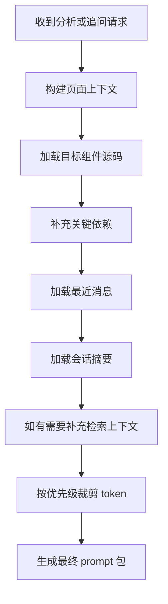

# C-Pointer AI 上下文拼接策略

## 目标

- 在不发送完整仓库的前提下，让结果尽量接近 Cursor/Codex 的单组件分析体验
- 控制 token、成本和响应时间
- 保持结论可追溯

## 核心原则

- 不直接发送完整项目
- 只发送当前问题的最小充分上下文
- 最近对话保留原文，更早对话保留摘要
- 上下文必须带来源信息

## 上下文分层

### Layer 1：页面上下文

用于告诉模型“当前是在什么页面场景下分析这个组件”。

字段建议：

- workspace
- environment
- page_url
- component_name
- data_insp_path
- file_path
- line
- column

### Layer 2：目标组件上下文

最重要的一层，始终存在。

内容建议：

- 目标组件完整源码
- 组件声明位置
- 关键 props / 类型定义

### Layer 3：关键依赖上下文

用于提升分析质量，但数量要受控。

内容建议：

- 直接 import 的业务子组件
- 相关 service
- store / selector / action
- domain 或 model
- 关键 constants / config

### Layer 4：检索补充上下文

按问题动态追加，不默认携带。

内容建议：

- 调用方
- 相关测试
- 相关配置
- 同模块关键文件

### Layer 5：会话摘要上下文

用于延续对话，而不是重复发送全部历史原文。

内容建议：

- 已确认事实
- 已回答问题
- 仍未解决的问题

## 上下文拼装流程



## 首次分析上下文模板

### 必带内容

- 页面上下文
- 目标组件源码
- 关键依赖文件
- 输出格式要求

### 可选内容

- 相关测试
- 配置文件
- 调用方

## 追问上下文模板

### 必带内容

- 当前问题
- 最近 5 到 10 轮消息
- 会话摘要
- 当前组件上下文

### 动态补充内容

- 如果问题问接口：补 service / API 文件
- 如果问题问状态：补 store / domain 文件
- 如果问题问影响范围：补引用方或同模块关键文件
- 如果问题问 POS / Web 差异：补另一个 workspace 对应文件

## token 预算建议

### 首次分析

- 页面上下文：5%
- 目标组件：35%
- 关键依赖：35%
- 输出要求与系统提示：10%
- 余量：15%

### 追问

- 最近消息：20%
- 会话摘要：10%
- 目标组件：25%
- 动态补充代码：35%
- 输出要求与系统提示：10%

## 裁剪优先级

当 token 超限时，按以下顺序裁剪：

1. 测试文件
2. 调用方文件
3. 次级依赖
4. 过长代码片段改为局部 snippet
5. 更早原始消息改为摘要

最后才裁剪目标组件本体。

## prompt 结构建议

```text
System:
你是一个面向产品、测试、开发的组件分析助手...

Context:
- workspace/environment/page_url
- data_insp_path 解析结果
- repo/branch/commit
- session summary

Code Pack:
- target component
- key dependencies
- optional retrieved files

User Ask:
- 默认分析问题 或 当前追问

Output Contract:
- summary
- interactions
- states
- dependencies
- evidence
- uncertainty
```

## 结果必须包含的证据字段

- `repo`
- `branch`
- `commit_sha`
- `target_file_path`
- `related_files`
- `confidence`

## 为什么不能发送完整项目

- token 成本过高
- 噪音过多，降低准确率
- 追问时无法持续扩展
- 对 GPT 不经济
- 无法逼近 Cursor/Codex 的“按需检索”模式

## 接近 Cursor/Codex 的关键

关键不在于“把所有代码都发给 GPT”，而在于：

- 后端具备仓库级检索能力
- 每轮只发送问题相关代码
- 会话中持续维护摘要和上下文快照
