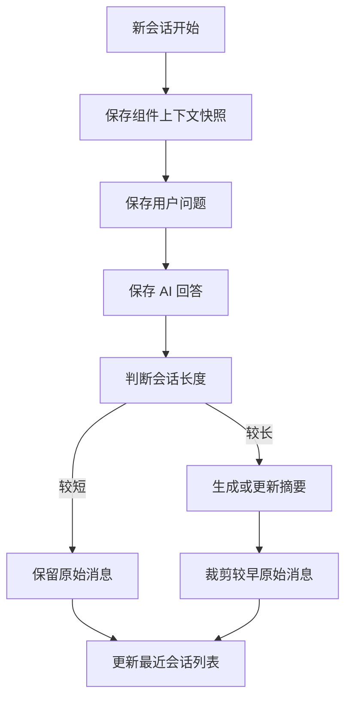
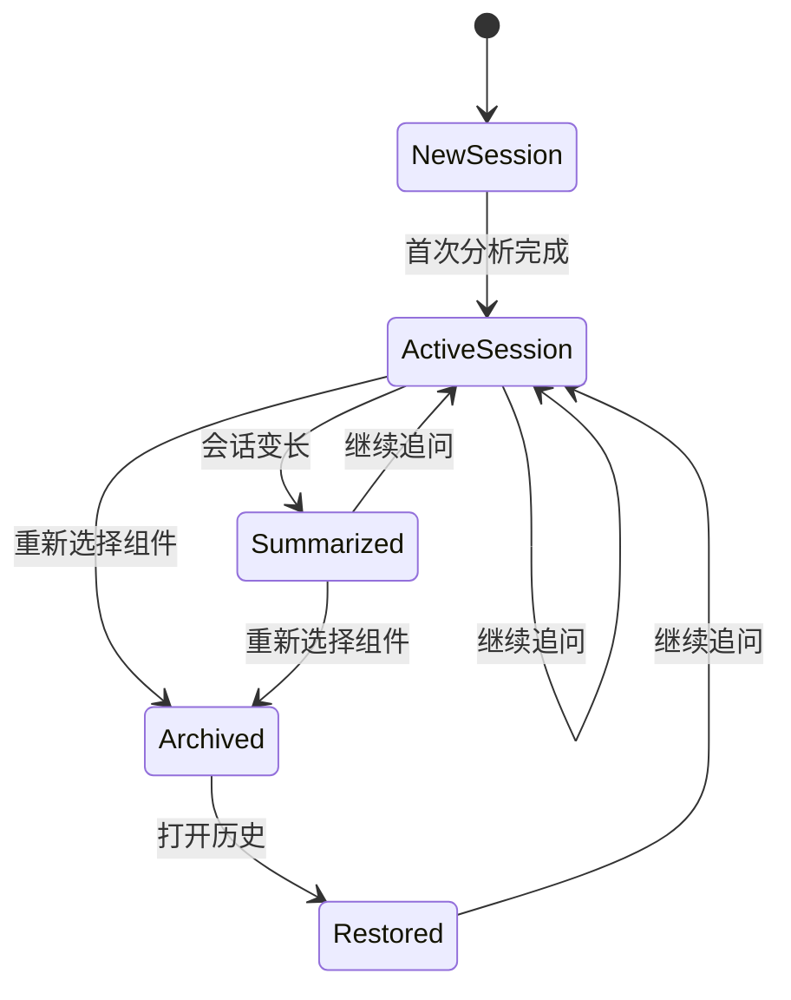

# C-Pointer 对话历史策略

## 目标

- 让每个浏览器或设备都有自己的分析历史
- 支持同一设备开启多个独立对话
- 支持短期连续追问
- 控制长会话 token 膨胀
- 历史保留 30 天

## 身份策略

首版不依赖应用登录态，使用设备级身份。

生成方式建议：

- 插件首次安装时生成 `device_user_id`
- 存入浏览器本地存储
- 每次请求都带上 `device_user_id`

## 历史分层

### 1. 会话列表

用于展示最近分析过哪些组件。

字段建议：

- session_id
- component_name
- workspace
- environment
- page_url
- last_message_at

说明：

- 同一 `device_user_id` 下可以有多个 session
- 历史列表按 `updated_at desc` 排序

### 2. 消息原文

用于保留最近几轮真实问答。

保留建议：

- 最近 5 到 10 轮原文

### 3. 会话摘要

用于压缩长对话。

摘要内容建议：

- 当前组件核心结论
- 已确认事实
- 已分析过的依赖
- 已回答过的重要问题
- 未解决问题

## 历史策略图

## 短期连续对话策略

### 首次分析后

- 自动创建 session
- 自动生成初始 summary

### 后续追问

- 优先复用当前 session
- 加载最近消息和 summary
- 仅在必要时补更多代码上下文

### 重新选择组件

- 默认创建新 session
- 原 session 标记为 `archived` 或保留为历史
- 用户可以在同一设备上保留多个活跃或近期会话

## 历史恢复策略

当用户重新打开历史会话时：

1. 返回 session 元信息
2. 返回最近消息
3. 返回 summary
4. 返回上次组件上下文快照
5. 不默认重放所有历史源码

## 数据保留建议

### 保留时间

- 会话、消息、摘要、上下文快照默认保留 30 天
- 每次新消息会刷新 session 的 `updated_at`
- 清理以 `updated_at + 30 天` 为准

### 必保留

- session 元数据
- 最近消息
- summary
- 组件上下文快照

### 可清理

- 超长历史原文
- 已缓存的完整上下文文件内容

## 清理策略

### 会话清理

- 每日清理 30 天未更新的 session
- 级联删除关联消息、摘要、上下文快照与 context files

### 消息压缩

- 保留最近 10 轮原文
- 更早消息压缩进 `summary`
- 压缩后可删除早期原文

## 隐私与安全

- 不绑定应用登录态
- 只以设备标识区分用户
- 不把完整源码历史都下发给插件
- 结果回显时使用结构化摘要优先

## 与 AI 的配合方式

### 发送给 AI 的历史内容

- 最近几轮原始消息
- 会话摘要
- 当前组件上下文

### 不发送给 AI 的历史内容

- 全量历史原文
- 无关旧会话
- 已失效的上下文文件

## 历史功能状态图

## 首版建议

- 先做设备级历史
- 先支持一个设备多个 session
- 先做最近会话列表
- 先做“最近消息 + 摘要”的混合策略
- 暂不做跨设备同步
