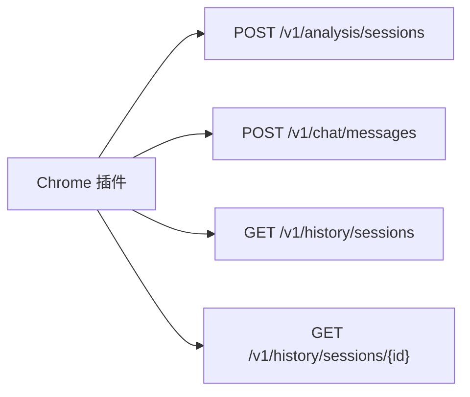

# C-Pointer 接口定义

## 设计原则

- 插件只调用后端，不直接调用 GitHub 或 GPT
- 接口围绕“会话”和“追问”设计
- 后端返回结构化结果，便于前端分层展示

## API 总览

### 1. 创建分析会话

- `POST /v1/analysis/sessions`

### 2. 发送追问消息

- `POST /v1/chat/messages`

### 3. 获取历史会话列表

- `GET /v1/history/sessions`

### 4. 获取单个会话详情

- `GET /v1/history/sessions/{sessionId}`

### 5. 健康检查

- `GET /v1/health`

## 1. 创建分析会话

### 请求

```json
{
  "device_user_id": "dev_abc123",
  "workspace": "pos",
  "environment": "test",
  "page_url": "https://pos-test.castlery.com/cart",
  "selection": {
    "data_insp_path": "libs/modules/cart/components/src/lib/pos-add-service-items/pos-add-service-items.tsx:119:7:Button",
    "selected_text": "Add service items",
    "dom_tag": "button"
  },
  "options": {
    "analysis_depth": "standard",
    "include_related_files": true
  }
}
```

### `data_insp_path` 解析规则

输入样例：

```text
libs/modules/cart/components/src/lib/pos-add-service-items/pos-add-service-items.tsx:119:7:Button
```

输出字段：

- `file_path`: `libs/modules/cart/components/src/lib/pos-add-service-items/pos-add-service-items.tsx`
- `line`: `119`
- `column`: `7`
- `component_name`: `Button`

### 响应

```json
{
  "session_id": "sess_001",
  "snapshot_id": "snap_001",
  "component": {
    "name": "Button",
    "file_path": "libs/modules/cart/components/src/lib/pos-add-service-items/pos-add-service-items.tsx",
    "line": 119,
    "column": 7,
    "workspace": "pos",
    "environment": "test",
    "repo": "castlery/joyboy",
    "branch": "master",
    "commit_sha": "abc123",
    "confidence": "high",
    "github_url": "https://github.com/castlery/joyboy/blob/master/libs/modules/cart/components/src/lib/pos-add-service-items/pos-add-service-items.tsx#L119"
  },
  "analysis": {
    "summary": "该按钮用于在 POS 购物车场景中添加服务类商品。",
    "display_content": [
      "按钮文案",
      "触发添加服务项动作"
    ],
    "interactions": [
      {
        "action": "点击按钮",
        "effect": "打开添加服务项流程"
      }
    ],
    "states": [
      {
        "name": "disabled",
        "description": "当前条件不满足时不可点击"
      }
    ],
    "dependencies": [
      {
        "file_path": "libs/modules/cart/services/src/lib/cart-service.ts",
        "role": "service"
      }
    ],
    "evidence": {
      "target_file_path": "libs/modules/cart/components/src/lib/pos-add-service-items/pos-add-service-items.tsx",
      "related_files": [
        "libs/modules/cart/services/src/lib/cart-service.ts"
      ],
      "confidence": "high"
    }
  }
}
```

## 2. 发送追问消息

### 请求

```json
{
  "device_user_id": "dev_abc123",
  "session_id": "sess_001",
  "message": "这个按钮点击后会调用哪个接口？"
}
```

### 响应

```json
{
  "session_id": "sess_001",
  "message_id": "msg_002",
  "answer": {
    "summary": "点击后会进入服务项添加流程，并进一步依赖购物车服务层接口。",
    "details": "从当前组件和相关 service 文件看，按钮本身更像触发入口，真正接口调用发生在 cart service 层。",
    "evidence": {
      "related_files": [
        "libs/modules/cart/services/src/lib/cart-service.ts"
      ],
      "confidence": "medium"
    }
  },
  "summary_updated": true
}
```

## 3. 获取历史会话列表

### 请求

- `GET /v1/history/sessions?device_user_id=dev_abc123&limit=20`

### 响应

```json
{
  "items": [
    {
      "session_id": "sess_001",
      "component_name": "Button",
      "workspace": "pos",
      "environment": "test",
      "page_url": "https://pos-test.castlery.com/cart",
      "last_message_at": "2026-04-09T10:00:00Z"
    }
  ]
}
```

## 4. 获取单个会话详情

### 请求

- `GET /v1/history/sessions/sess_001?device_user_id=dev_abc123`

### 响应

```json
{
  "session": {
    "session_id": "sess_001",
    "component_name": "Button",
    "workspace": "pos",
    "environment": "test",
    "page_url": "https://pos-test.castlery.com/cart",
    "repo": "castlery/joyboy",
    "branch": "master",
    "commit_sha": "abc123"
  },
  "summary": {
    "summary_text": "该组件是 POS 购物车中添加服务项的入口按钮。",
    "confirmed_facts": [
      "组件位于 cart 模块",
      "点击后会触发添加流程"
    ],
    "open_questions": [
      "后续具体接口在哪个 service 中调用"
    ]
  },
  "recent_messages": [
    {
      "role": "user",
      "content": "这个按钮点击后会调用哪个接口？"
    },
    {
      "role": "assistant",
      "content": "当前组件更像入口，接口调用下沉到 service 层。"
    }
  ]
}
```

## 5. 健康检查

### 响应

```json
{
  "status": "ok",
  "checks": {
    "github": "ok",
    "gpt": "ok",
    "history_store": "ok"
  }
}
```

## 错误码建议

| code | meaning |
|---|---|
| `UNSUPPORTED_PAGE` | 页面不在支持站点 |
| `INSPECTOR_PATH_MISSING` | 未获取到 `data-insp-path` |
| `PATH_PARSE_FAILED` | 路径格式解析失败 |
| `SOURCE_NOT_FOUND` | GitHub 中未找到目标文件 |
| `GPT_UNAVAILABLE` | GPT 服务暂不可用 |
| `SESSION_NOT_FOUND` | 历史会话不存在 |
| `INTERNAL_ERROR` | 内部错误 |

## 接口时序与职责



## 首版接口风格建议

- REST 为主
- 返回结构化 JSON
- 不在首版引入流式响应
- 如需流式回答，可作为后续增强
