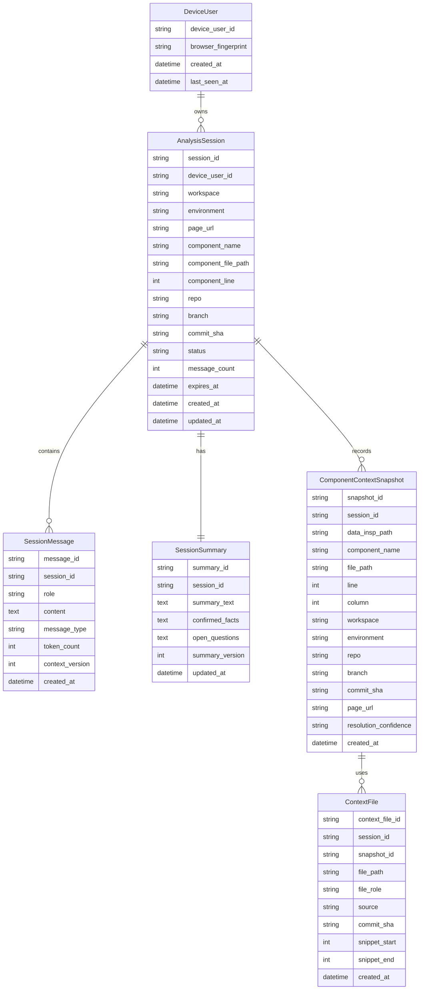

# C-Pointer 数据模型

## 数据设计目标

- 支持设备级会话历史
- 支持单设备开启多个独立对话
- 支持组件级上下文快照
- 支持会话摘要压缩
- 支持追溯每次回答所依赖的源码版本
- 使用轻量级关系型存储承载历史数据

## 存储选型建议

首版建议使用轻量级关系型存储模型，优先顺序如下：

### 生产或多人共享环境

- 推荐：`PostgreSQL`

原因：

- 支持多用户并发
- 支持索引、分页、定时清理
- 后续扩展空间更大

### 本地开发或单机原型

- 推荐：`SQLite`

原因：

- 轻量
- 零运维
- 易于快速验证流程

结论：

- 逻辑模型按关系型数据库设计
- SQL 结构尽量兼容 PostgreSQL / SQLite
- 共享后端部署时优先落 PostgreSQL

## 核心实体

### DeviceUser

用于表示一个浏览器或设备上的匿名用户身份。

关键字段：

- `device_user_id`
- `browser_fingerprint`
- `created_at`
- `last_seen_at`

### AnalysisSession

一次围绕某个组件的分析会话。

关键字段：

- `session_id`
- `device_user_id`
- `workspace`
- `environment`
- `page_url`
- `component_name`
- `component_file_path`
- `component_line`
- `repo`
- `branch`
- `commit_sha`
- `status`
- `message_count`
- `expires_at`
- `created_at`
- `updated_at`

### SessionMessage

会话中的一条消息。

关键字段：

- `message_id`
- `session_id`
- `role`
- `content`
- `message_type`
- `token_count`
- `context_version`
- `created_at`

### SessionSummary

对长会话的摘要压缩。

关键字段：

- `summary_id`
- `session_id`
- `summary_text`
- `confirmed_facts`
- `open_questions`
- `summary_version`
- `updated_at`

### ComponentContextSnapshot

用于记录一次分析时实际使用的组件上下文和代码定位结果。

关键字段：

- `snapshot_id`
- `session_id`
- `data_insp_path`
- `component_name`
- `file_path`
- `line`
- `column`
- `workspace`
- `environment`
- `repo`
- `branch`
- `commit_sha`
- `page_url`
- `resolution_confidence`
- `created_at`

### ContextFile

本轮分析或追问实际纳入 AI 的文件集合。

关键字段：

- `context_file_id`
- `session_id`
- `snapshot_id`
- `file_path`
- `file_role`
- `source`
- `commit_sha`
- `snippet_start`
- `snippet_end`
- `created_at`

## ER 图



## file_role 建议枚举

- `target_component`
- `types`
- `service`
- `store`
- `domain`
- `child_component`
- `config`
- `test`

## 会话状态建议枚举

- `active`
- `archived`
- `failed`
- `expired`

## message_type 建议枚举

- `analysis_init`
- `user_question`
- `assistant_answer`
- `system_notice`

## 存储策略

### 必须持久化

- DeviceUser
- AnalysisSession
- SessionMessage
- SessionSummary
- ComponentContextSnapshot

### 可缓存

- ContextFile 内容
- GitHub 文件内容
- 路径解析结果
- AI 分析结果

## 表设计建议

以下表结构用于支撑“设备级用户、多会话、30 天保留、摘要压缩”的需求。

### 1. `device_users`

用途：

- 记录一个浏览器或设备身份

关键字段：

- `device_user_id` PK
- `browser_fingerprint`
- `created_at`
- `last_seen_at`

### 2. `analysis_sessions`

用途：

- 一次组件分析会话

关键字段：

- `session_id` PK
- `device_user_id` FK
- `workspace`
- `environment`
- `page_url`
- `component_name`
- `component_file_path`
- `component_line`
- `repo`
- `branch`
- `commit_sha`
- `status`
- `message_count`
- `expires_at`
- `created_at`
- `updated_at`

说明：

- 一个 `device_user_id` 可以对应多个 `analysis_sessions`
- `expires_at` 默认设置为 `created_at + 30 天`

### 3. `session_messages`

用途：

- 存储会话中的消息原文

关键字段：

- `message_id` PK
- `session_id` FK
- `role`
- `message_type`
- `content`
- `token_count`
- `context_version`
- `created_at`

说明：

- 只保留最近若干轮原文作为“热消息”
- 更早消息可压缩、裁剪或标记为归档

### 4. `session_summaries`

用途：

- 存储长会话摘要

关键字段：

- `summary_id` PK
- `session_id` FK UNIQUE
- `summary_text`
- `confirmed_facts`
- `open_questions`
- `summary_version`
- `updated_at`

### 5. `component_context_snapshots`

用途：

- 记录当次分析对应的页面和源码上下文

关键字段：

- `snapshot_id` PK
- `session_id` FK
- `data_insp_path`
- `component_name`
- `file_path`
- `line`
- `column`
- `workspace`
- `environment`
- `repo`
- `branch`
- `commit_sha`
- `page_url`
- `resolution_confidence`
- `created_at`

### 6. `context_files`

用途：

- 记录进入 AI prompt 的代码文件范围

关键字段：

- `context_file_id` PK
- `session_id` FK
- `snapshot_id` FK
- `file_path`
- `file_role`
- `source`
- `commit_sha`
- `snippet_start`
- `snippet_end`
- `created_at`

## 索引建议

- `analysis_sessions(device_user_id, updated_at desc)`
- `analysis_sessions(expires_at)`
- `session_messages(session_id, created_at asc)`
- `component_context_snapshots(session_id, created_at desc)`
- `context_files(session_id, snapshot_id)`

## SQL DDL 示例

```sql
create table device_users (
  device_user_id varchar(64) primary key,
  browser_fingerprint varchar(255),
  created_at timestamp not null,
  last_seen_at timestamp not null
);

create table analysis_sessions (
  session_id varchar(64) primary key,
  device_user_id varchar(64) not null references device_users(device_user_id),
  workspace varchar(16) not null,
  environment varchar(16) not null,
  page_url text not null,
  component_name varchar(255) not null,
  component_file_path text not null,
  component_line integer,
  repo varchar(255) not null,
  branch varchar(255) not null,
  commit_sha varchar(64),
  status varchar(16) not null,
  message_count integer not null default 0,
  expires_at timestamp not null,
  created_at timestamp not null,
  updated_at timestamp not null
);

create table session_messages (
  message_id varchar(64) primary key,
  session_id varchar(64) not null references analysis_sessions(session_id),
  role varchar(16) not null,
  message_type varchar(32) not null,
  content text not null,
  token_count integer,
  context_version integer not null default 1,
  created_at timestamp not null
);

create table session_summaries (
  summary_id varchar(64) primary key,
  session_id varchar(64) not null unique references analysis_sessions(session_id),
  summary_text text not null,
  confirmed_facts text,
  open_questions text,
  summary_version integer not null default 1,
  updated_at timestamp not null
);

create table component_context_snapshots (
  snapshot_id varchar(64) primary key,
  session_id varchar(64) not null references analysis_sessions(session_id),
  data_insp_path text not null,
  component_name varchar(255) not null,
  file_path text not null,
  line integer,
  column_no integer,
  workspace varchar(16) not null,
  environment varchar(16) not null,
  repo varchar(255) not null,
  branch varchar(255) not null,
  commit_sha varchar(64),
  page_url text not null,
  resolution_confidence varchar(16) not null,
  created_at timestamp not null
);

create table context_files (
  context_file_id varchar(64) primary key,
  session_id varchar(64) not null references analysis_sessions(session_id),
  snapshot_id varchar(64) not null references component_context_snapshots(snapshot_id),
  file_path text not null,
  file_role varchar(32) not null,
  source varchar(32) not null,
  commit_sha varchar(64),
  snippet_start integer,
  snippet_end integer,
  created_at timestamp not null
);
```
