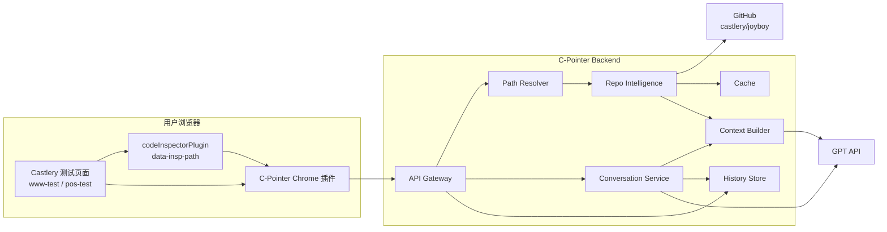
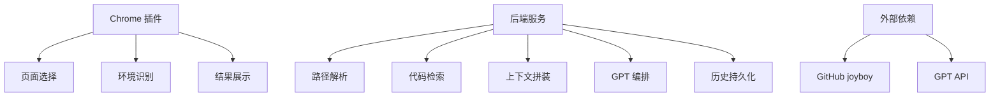
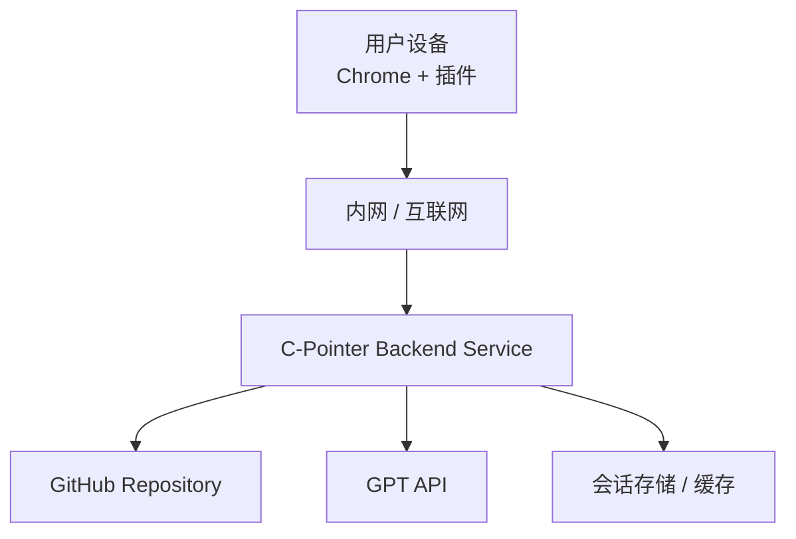

# C-Pointer 整体架构

## 架构结论

首版推荐架构：

- Chrome 插件
- 后端服务
- GPT API
- GitHub 仓库访问层
- 代码检索与上下文组装层

不推荐首版使用“插件直连 GitHub + 插件直连 GPT API”的正式方案。

## 设计目标

- 插件负责页面选择与交互，不承担源码和 AI 凭证管理
- 后端负责代码访问、上下文组装、GPT 调用、历史存储
- 结果效果尽量接近 Cursor/Codex 的“单组件分析体验”

## 总体架构图

## 责任边界

### 插件职责

- 识别当前站点是否为支持环境
- 获取当前 workspace 与 environment
- 解析页面中的 `data-insp-path`
- 发起分析请求和追问请求
- 展示结果、源码证据和会话历史

### 后端职责

- 验证并解析 `data-insp-path`
- 管理 `joyboy` 仓库访问
- 按需检索目标组件及关键依赖
- 组装 AI 所需上下文
- 调用 GPT API
- 存储设备级会话与摘要
- 提供审计、缓存和限流

### GPT 职责

- 基于上下文生成业务解释
- 回答追问
- 输出结构化结论

## 为什么需要后端

### 安全原因

- GitHub 仓库可能是私有的
- GPT API key 不应进入插件

### 能力原因

- 需要全仓搜索与依赖扩展
- 需要会话持久化
- 需要缓存与摘要
- 需要统一控制 prompt 和模型策略

### 体验原因

- 插件无需承担复杂代码检索逻辑
- 多设备历史和追问更容易做

## 首版最小架构切片

### 必须有

- 插件入口与选择模式
- `data-insp-path` 解析
- GitHub 文件读取
- GPT 分析
- 会话保存

### 可延后

- 全仓高级 symbol index
- 跨端差异自动对比
- 团队共享知识库

## 组件职责图

## 部署视图

