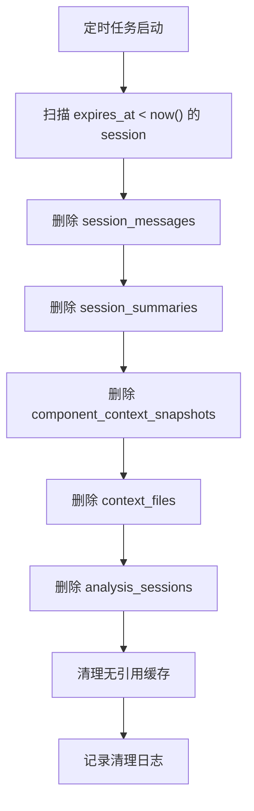
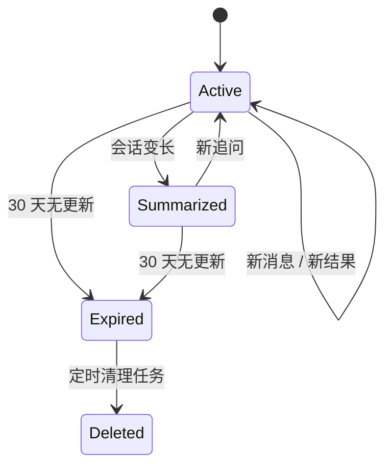

# C-Pointer 存储与清理策略

## 目标

- 用轻量级关系型模型保存设备级历史
- 支持单设备多个独立对话
- 历史保留 30 天
- 通过摘要压缩保持对话体验接近 Codex

## 存储原则

- 正式历史保存在后端
- 插件本地只保存 `device_user_id` 和轻量 UI 状态
- 每个设备可以拥有多个并行会话
- 会话和消息分层存储，不把所有历史都直接喂给 AI

## 推荐存储方案

### 生产环境

- 推荐：PostgreSQL

### 本地开发

- 推荐：SQLite

### 原因

- 两者都适合轻量关系型模型
- 结构简单，便于快速落地
- 能支持 30 天 TTL、索引查询、后台清理任务

## 会话保留规则

### 默认保留

- 所有会话保留 30 天

### 到期规则

- `expires_at = max(created_at, updated_at) + 30 天`
- 每次新消息或新分析结果返回时刷新 `updated_at`
- 会话是否续命以 `updated_at` 为准，而不是只看 `created_at`

## 单设备多会话策略

一个设备用户可以开启多个会话：

- 不同组件默认新建会话
- 同一组件也允许重复开启新会话
- 历史列表按最近更新时间排序

## 为什么这样更像 Codex

Codex 风格不是“一个用户只有一条无限长聊天记录”，而是：

- 按任务保留多个会话
- 每个会话有自己的上下文
- 会话内部用摘要压缩长历史

C-Pointer 也按这个方式设计：

- 一个组件分析任务就是一个 session
- 一个设备可同时拥有多个 session
- AI 使用“最近消息 + 摘要 + 当前代码上下文”

## 清理策略

### 1. 定时清理过期会话

执行频率建议：

- 每天 1 次

清理内容：

- `expires_at < now()` 的 `analysis_sessions`
- 级联删除对应的 `session_messages`
- 级联删除对应的 `session_summaries`
- 级联删除对应的 `component_context_snapshots`
- 级联删除对应的 `context_files`

### 2. 长会话消息裁剪

执行频率建议：

- 每次新增消息后异步判断

策略：

- 保留最近 10 轮原文
- 将更早内容压缩进 `session_summaries`
- 可将过早原文删除或转冷存储

### 3. 缓存清理

清理对象：

- GitHub 文件缓存
- 路径解析缓存
- AI 结果缓存

建议 TTL：

- GitHub 文件缓存：6 小时
- 路径解析缓存：24 小时
- AI 结果缓存：24 小时

### 4. 无效设备清理

执行频率建议：

- 每周 1 次

策略：

- 如果 `device_users` 在 45 天内无任何 session 和访问记录，可清理

## 清理流程图

## 生命周期图

## 后端任务建议

### Job 1：Session Expiration Cleanup

- 周期：每日
- 职责：删除过期 session 及其关联数据

### Job 2：Session Summarization

- 周期：每次消息写入后触发异步任务
- 职责：压缩长会话消息，更新 summary

### Job 3：Cache Cleanup

- 周期：每小时或每日
- 职责：清理过期代码缓存和 AI 缓存

## 实现建议

- 清理策略在数据库和应用层双保险
- 关键表使用外键级联删除
- 对话恢复依赖 `session_summary`，而不是依赖全量消息永远存在
