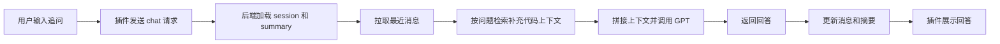
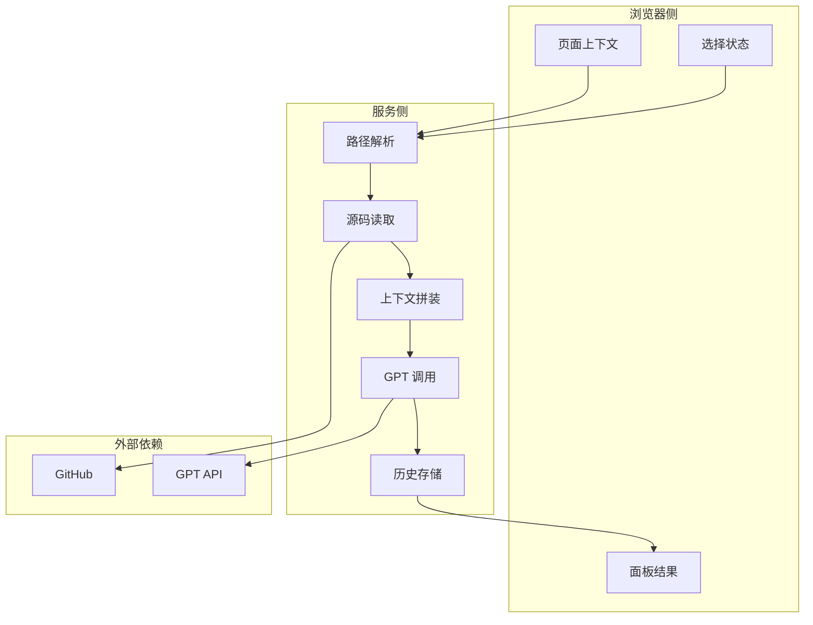

# C-Pointer 数据流程

## 数据流程目标

- 说明从页面组件到 AI 结果的完整链路
- 明确插件、后端、GitHub、GPT 之间的数据边界
- 明确哪些数据进入持久化层

## 首次组件分析数据流

```mermaid
flowchart LR
    A["测试页面 DOM"] --> B["codeInspectorPlugin 输出 data-insp-path"]
    B --> C["Chrome 插件读取页面信息"]
    C --> D["插件识别 workspace / environment"]
    D --> E["发送 analyze 请求到后端"]
    E --> F["后端解析 data-insp-path"]
    F --> G["定位 GitHub 文件路径"]
    G --> H["读取目标源码与关键依赖"]
    H --> I["构建 AI 上下文包"]
    I --> J["调用 GPT API"]
    J --> K["返回结构化分析结果"]
    K --> L["保存会话与摘要"]
    L --> M["插件展示结果"]
```

## 追问数据流

## 数据边界

### 插件发送给后端

- `workspace`
- `environment`
- `page_url`
- `data_insp_path`
- `selected_text` 或页面最小上下文
- `session_id` 或设备标识
- 用户问题

### 后端读取但不直接暴露给插件

- GitHub token
- GPT API key
- 完整源码缓存
- prompt 模板

### 后端持久化

- 会话元数据
- 消息
- 摘要
- 上下文快照

## 数据分层图

