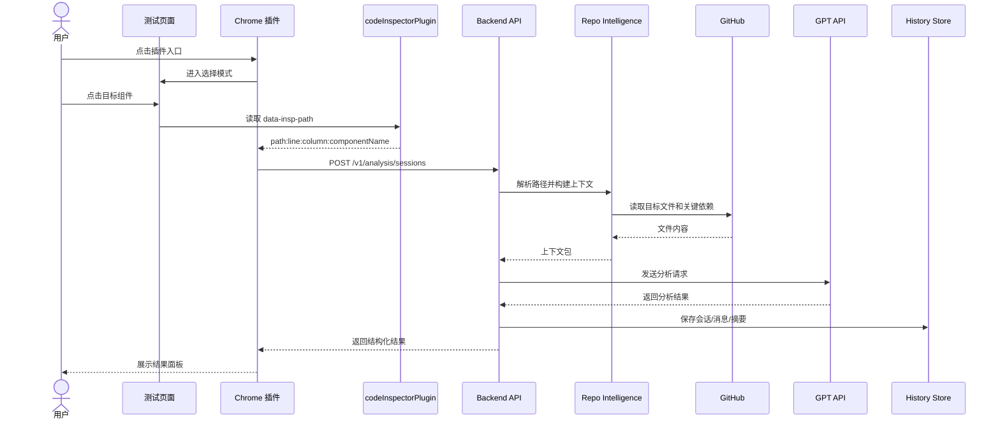
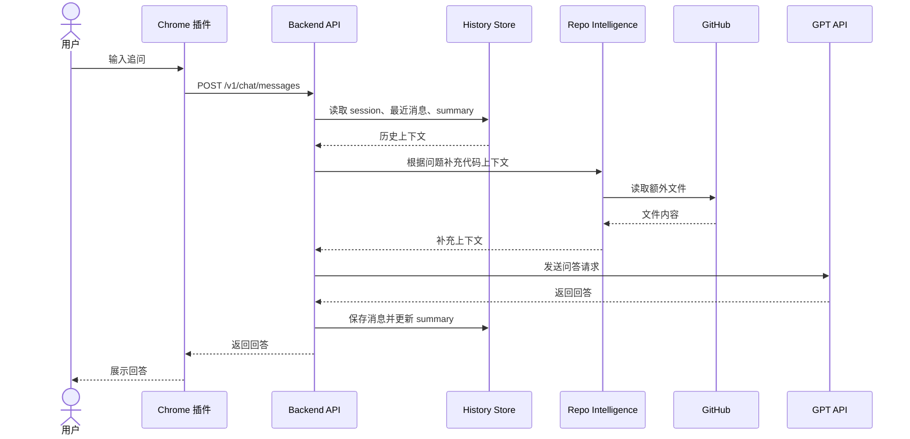
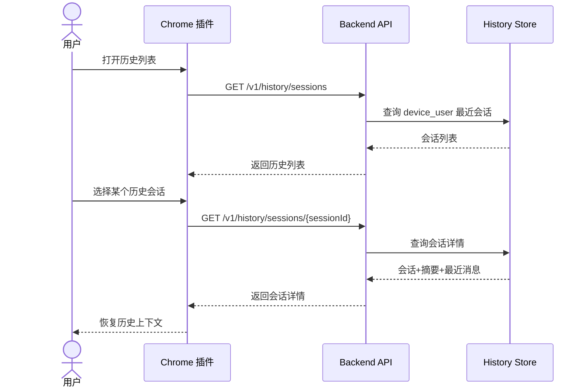

# C-Pointer 时序图

## 首次组件分析时序图

```mermaid
sequenceDiagram
    actor User as 用户
    participant Page as 测试页面
    participant Plugin as Chrome 插件
    participant Inspector as codeInspectorPlugin
    participant API as Backend API
    participant Repo as Repo Intelligence
    participant GitHub as GitHub
    participant GPT as GPT API
    participant Store as History Store

    User->>Plugin: 点击插件入口
    Plugin->>Page: 进入选择模式
    User->>Page: 点击目标组件
    Page->>Inspector: 读取 data-insp-path
    Inspector-->>Plugin: path:line:column:componentName
    Plugin->>API: POST /v1/analysis/sessions
    API->>Repo: 解析路径并构建上下文
    Repo->>GitHub: 读取目标文件和关键依赖
    GitHub-->>Repo: 文件内容
    Repo-->>API: 上下文包
    API->>GPT: 发送分析请求
    GPT-->>API: 返回分析结果
    API->>Store: 保存会话/消息/摘要
    API-->>Plugin: 返回结构化结果
    Plugin-->>User: 展示结果面板
```

## 追问时序图

```mermaid
sequenceDiagram
    actor User as 用户
    participant Plugin as Chrome 插件
    participant API as Backend API
    participant Store as History Store
    participant Repo as Repo Intelligence
    participant GitHub as GitHub
    participant GPT as GPT API

    User->>Plugin: 输入追问
    Plugin->>API: POST /v1/chat/messages
    API->>Store: 读取 session、最近消息、summary
    Store-->>API: 历史上下文
    API->>Repo: 根据问题补充代码上下文
    Repo->>GitHub: 读取额外文件
    GitHub-->>Repo: 文件内容
    Repo-->>API: 补充上下文
    API->>GPT: 发送问答请求
    GPT-->>API: 返回回答
    API->>Store: 保存消息并更新 summary
    API-->>Plugin: 返回回答
    Plugin-->>User: 展示回答
```

## 历史恢复时序图

```mermaid
sequenceDiagram
    actor User as 用户
    participant Plugin as Chrome 插件
    participant API as Backend API
    participant Store as History Store

    User->>Plugin: 打开历史列表
    Plugin->>API: GET /v1/history/sessions
    API->>Store: 查询 device_user 最近会话
    Store-->>API: 会话列表
    API-->>Plugin: 返回历史列表
    User->>Plugin: 选择某个历史会话
    Plugin->>API: GET /v1/history/sessions/{sessionId}
    API->>Store: 查询会话详情
    Store-->>API: 会话+摘要+最近消息
    API-->>Plugin: 返回会话详情
    Plugin-->>User: 恢复历史上下文
```
