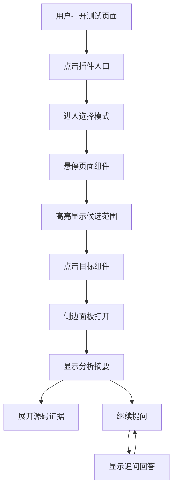
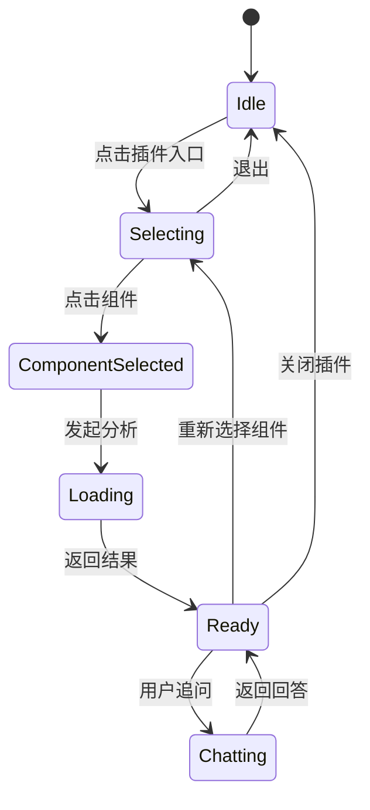

# C-Pointer 交互设计

## 交互目标

- 一条主交互链：入口、选择、结果、追问
- 用户无需理解仓库、分支、AI 模型等技术细节
- 结果面板要同时兼顾业务阅读和源码验证

## 首版核心界面

### 1. 插件入口

- 浏览器插件图标
- 负责激活或关闭选择模式

### 2. 页面选择层

- 悬停高亮
- 选中态高亮
- 当前命中组件提示

### 3. 结果侧边面板

- 顶部：当前组件摘要、环境、GitHub 入口
- 中部：业务结论、状态、交互、依赖、证据
- 底部：追问输入框、历史入口

## 用户交互图

## 面板信息层级

### 默认展开

- 组件名称
- workspace / environment
- 业务概述
- 关键展示内容
- 关键交互
- 关键状态

### 二级展开

- 文件路径
- GitHub 链接
- 关键代码片段
- 依赖文件
- 影响范围

### 深入追问

- 具体接口
- 依赖链
- 调用关系
- 跨端差异

## 交互状态图

## 异常交互

### 场景 1：不支持页面

- 显示“当前页面不支持分析”
- 不进入选择模式

### 场景 2：缺少 codeInspectorPlugin

- 显示“无法获取组件源码定位信息”
- 允许用户重试或查看安装说明

### 场景 3：GitHub 读取失败

- 显示“已选中组件，但未能读取源码”
- 保留页面上下文和组件基础信息

### 场景 4：AI 分析失败

- 保留已解析的源码入口和上下文
- 提供重试入口
