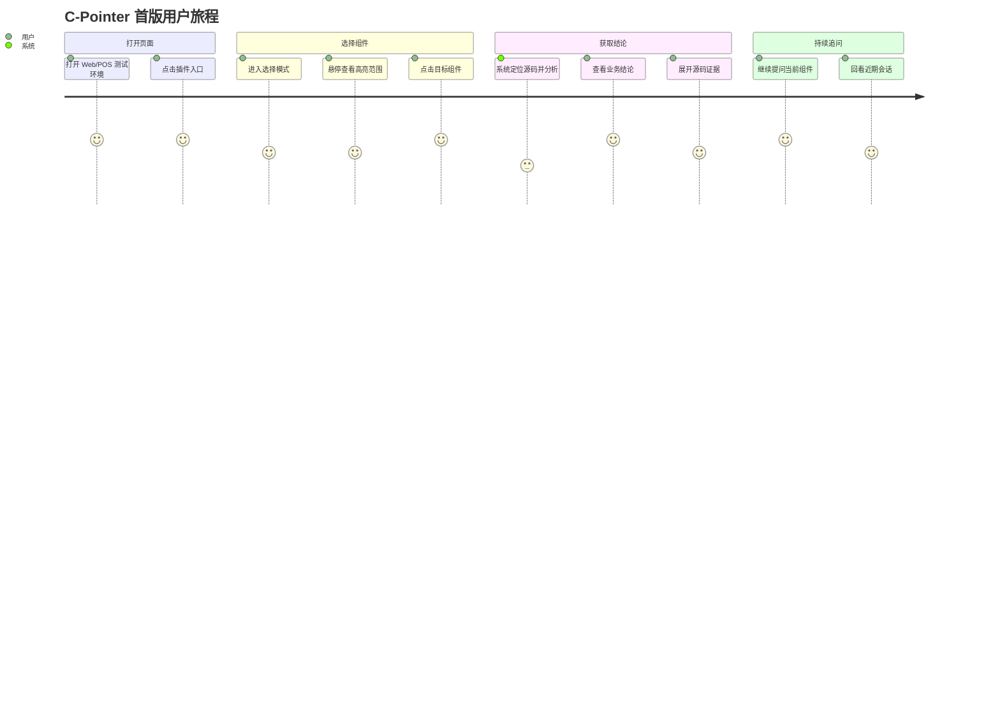

# C-Pointer 产品总览

## 产品定义

`C-Pointer` 是一个内部浏览器插件，用于在 Castlery 的 Web 与 POS 测试环境中，从页面组件反向定位源码，并生成接近 Cursor/Codex 风格的组件分析结果。

它面向产品、测试、开发三类用户，但首版输出默认以“业务可读 + 技术可验证”为原则：

- 先给业务结论
- 再给源码证据
- 支持围绕当前组件持续追问

## 已确认前提

- Web 测试环境：`https://www-test.castlery.com/`
- POS 测试环境：`https://pos-test.castlery.com/`
- Web 与 POS 共用仓库：`https://github.com/castlery/joyboy`
- 页面定位输入来自 `codeInspectorPlugin`
- `codeInspectorPlugin` 样例字段：

```html
data-insp-path="libs/modules/cart/components/src/lib/pos-add-service-items/pos-add-service-items.tsx:119:7:Button"
```

- 首版身份维度：按浏览器或设备区分用户，不依赖应用登录态
- AI 能力来源：GPT API

## 产品目标

### 业务目标

- 降低 PM、QA、开发理解页面组件的成本。
- 缩短“页面问题 -> 定位组件 -> 读取源码 -> 形成结论”的链路。
- 为 Web 和 POS 提供统一的组件分析入口。

### 体验目标

- 用户能在 3 步内完成组件分析。
- 结果默认可读，必要时可展开技术细节。
- 用户可以围绕当前组件多轮追问，不必重复选择组件。

## 非目标

- 不直接修改页面或写回仓库。
- 不在首版取代 IDE、DevTools 或 GitHub 搜索。
- 不要求首版达到完整代码助手级别的全仓推理能力。

## 目标用户

### 产品经理

- 关心组件的业务作用、展示内容、交互行为、影响范围。

### 测试人员

- 关心状态、边界、错误态、依赖接口和测试建议。

### 开发人员

- 关心真实文件、行号、依赖链、调用关系和分支上下文。

## 核心产品原则

- 页面优先：从当前页面出发，而不是从仓库目录出发。
- 证据优先：结论必须可以回到源码和页面上下文。
- 渐进披露：默认摘要，逐步展开细节。
- 一条主链：选择、分析、追问是一条连续主流程。
- 安全优先：GitHub 和 GPT 凭证不进入浏览器插件。

## 推荐首版方案

首版推荐采用：

- 插件：负责组件选择、页面上下文采集、结果展示、追问入口
- 后端：负责 GitHub 读取、路径校验、代码检索、GPT 调用、历史持久化
- GPT：负责业务分析、问答、结果结构化

## 用户旅程图


